# Homelab Manager (PHP)

Kurze Beschreibung
------------------
Homelab Manager ist ein in PHP geschriebenes Tool zur Verwaltung und Inventarisierung deines Homelabs. Das System verwaltet Geräte, Racks, Kabel, Patch‑Panels und Speicher und bietet einfache Überwachungs‑ und Verwaltungsfunktionen. Optional kann für lokale Abfragen ein Python‑Script gestartet werden.

Was das System verwaltet
------------------------
- Geräte (Server, Router, Switches, Appliances)
- Racks (Positionen, Höhe, Zuordnung)
- Kabel (Patchkabel, Längen, Querverbindungen)
- Patch‑Panels (Ports, Labeling)
- Speicher (Volume, Freigaben, Kapazitäten)

Features
--------
- Gerätedaten erfassen und verwalten
- Rack‑ und Verkabelungsübersicht
- Patch‑Panel‑Management
- Basis‑Monitoring / Healthchecks (Ping, Status)
- Dashboard für schnelle Übersicht
- Möglichkeit, lokale Abfragen / Scans per Python‑Script zu starten

Technische Angaben
------------------
- Sprache: PHP
- Unterstützte Webserver: Apache / Nginx
- Datenbank: MySQL / MariaDB (optional)
- Empfohlene PHP‑Version: 8.0+
- Optionales Python‑Script für lokale Abfragen (Python 3.8+ empfohlen)

Schnellstart — Installation
---------------------------
1. Repository klonen:
   ```bash
   git clone https://github.com/philipplindner-media-network/homelab_manager_php.git
   cd homelab_manager_php
   ```
2. PHP‑Abhängigkeiten (falls Composer verwendet wird):
   ```bash
   composer install
   ```
3. Konfigurationsdatei erstellen:
   - Kopiere `config/config.php` → `config/config.php`
   - Passe DB‑Zugangsdaten, Base‑URL und andere Einstellungen an.
4. Webserver konfigurieren:
   - DocumentRoot auf das `public/`‑Verzeichnis setzen (oder entsprechend anpassen).
5. Datenbank (optional):
   - Lege eine Datenbank an und importiere ggf. das Schema aus `db/schema.sql`.


Konfiguration
-------------
- `config/config.example.php` enthält alle konfigurierbaren Parameter.
- Für Umgebungsvariablen kannst du eine `.env`‑Lösung ergänzen oder die config‑Datei direkt anpassen.

Screenshots / Bilder
---------------------------------
Hier eine Par Bilder

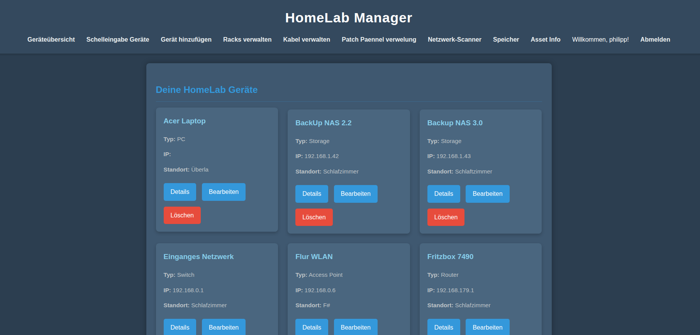
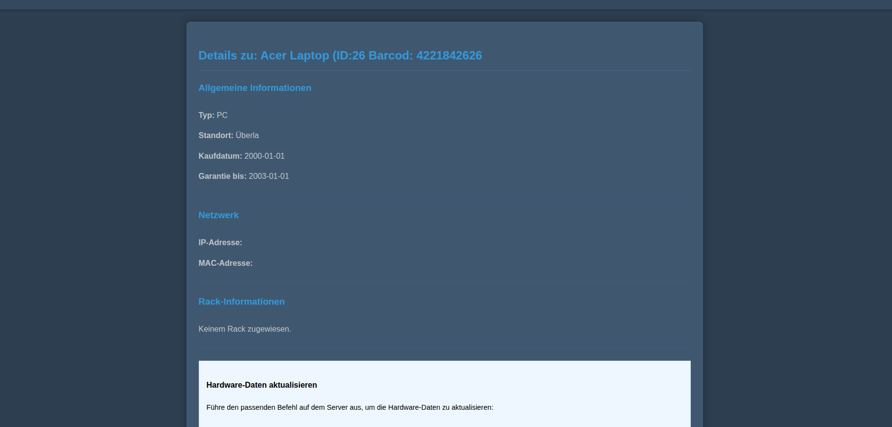
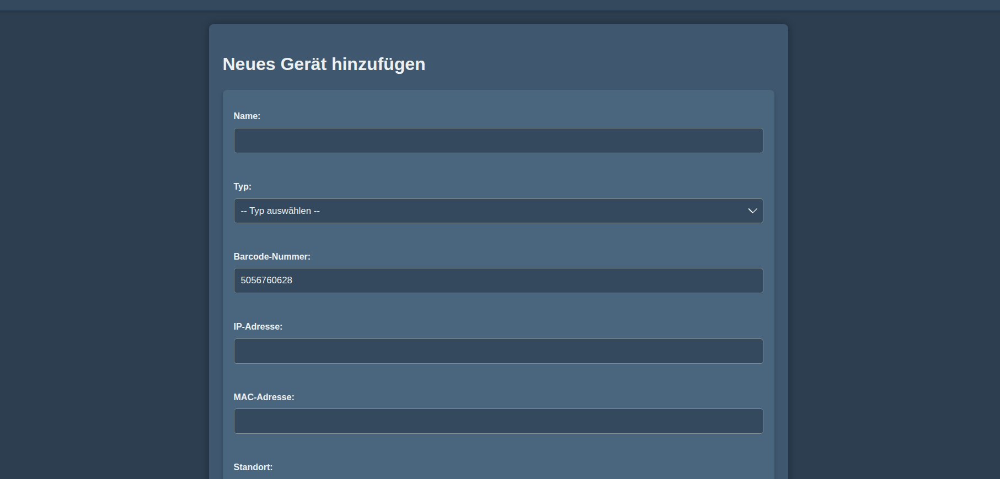
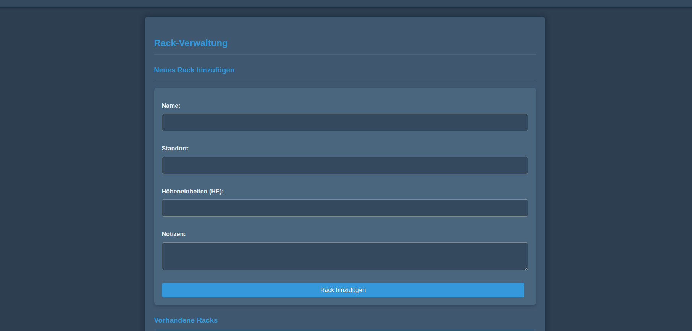
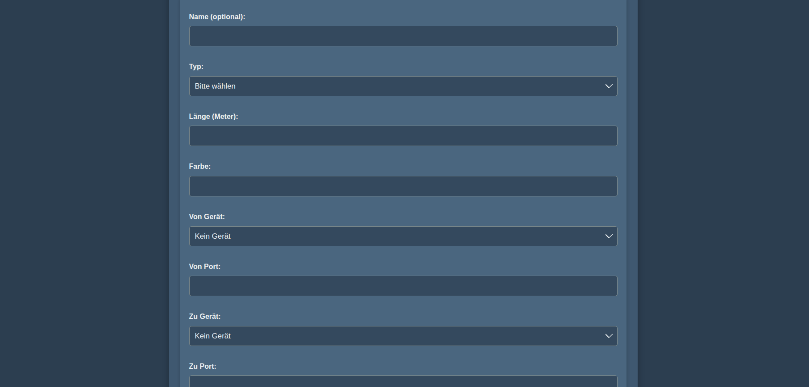
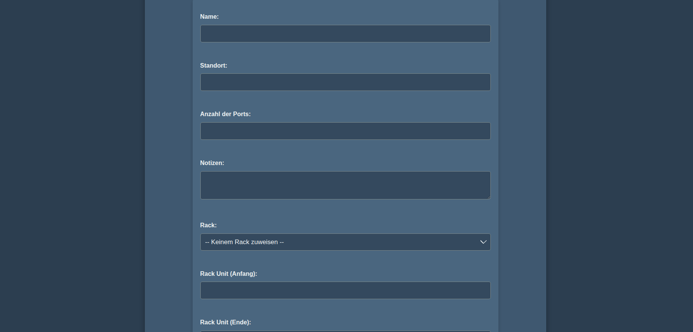
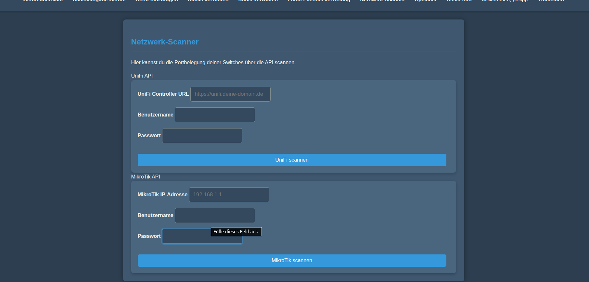
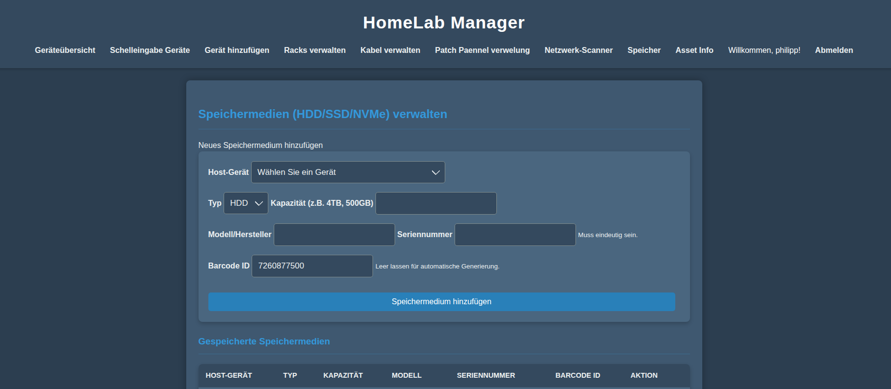
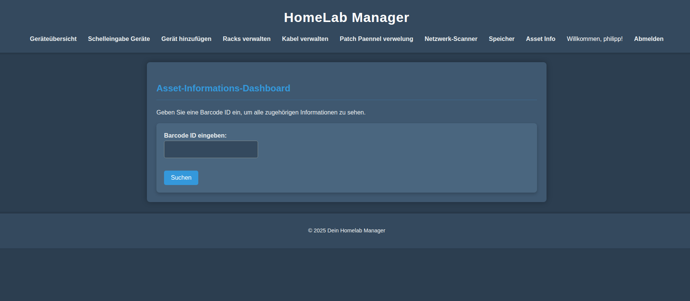
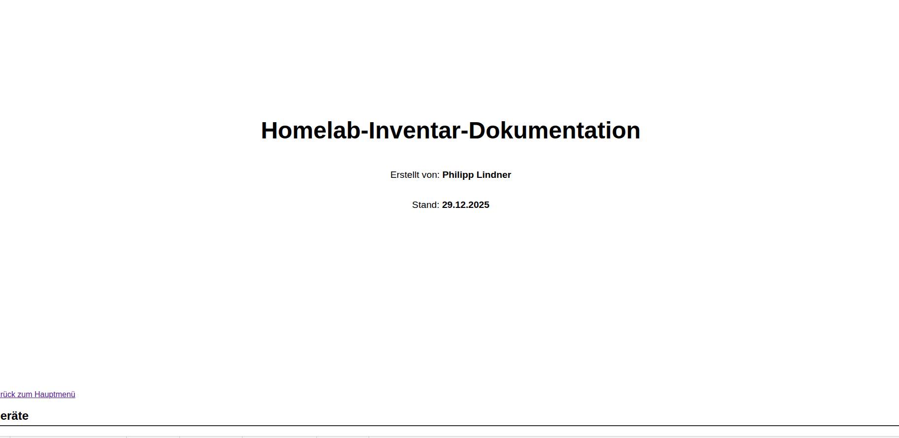
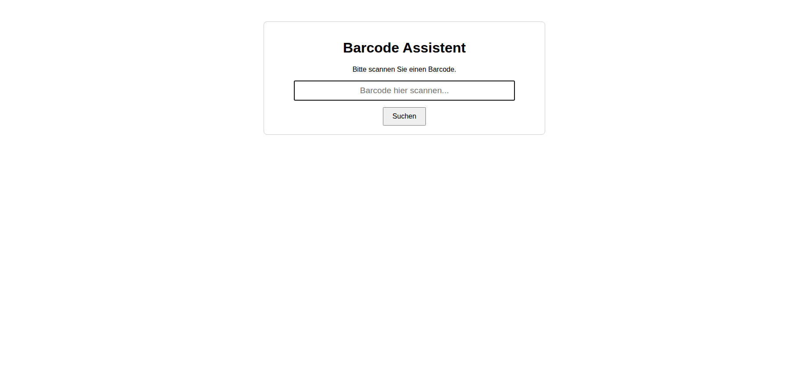
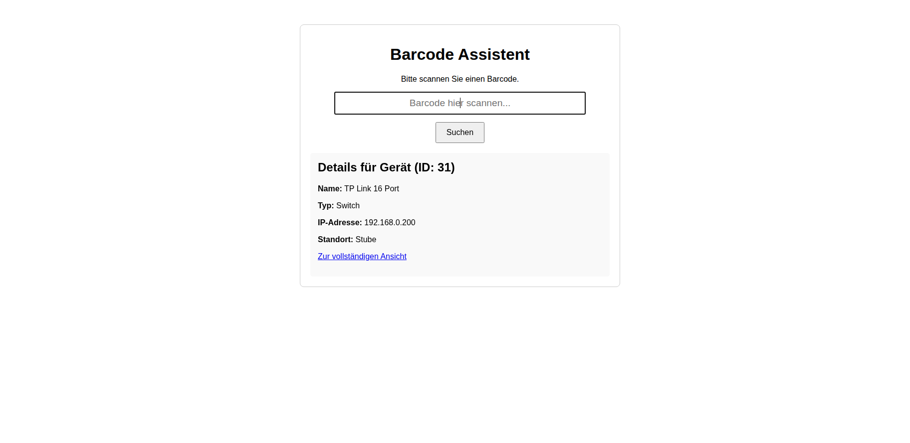


Kontribution
-----------
Beiträge sind willkommen! Ablauf:
1. Issue anlegen, wenn du ein größeres Feature planst.
2. Branch erstellen: `git checkout -b feature/mein-feature`
3. PR mit Beschreibung öffnen.

Beispiel für einen Issue‑Titel:
- Titel: "Feature: Verkabelungsvisualisierung erweitern"
- Beschreibung: Warum benötigt, Vorschlag zur Umsetzung, Bildschirmfotos/Mockups

Lizenz
------
Dieses Projekt steht unter der MIT‑Lizenz. Bitte füge eine LICENSE‑Datei hinzu (z. B. MIT) oder nutze die vorhandene [LICENSE](./LICENSE).

Kontakt
-------
Bei Fragen oder Feedback: philipplindner-media-network auf GitHub
